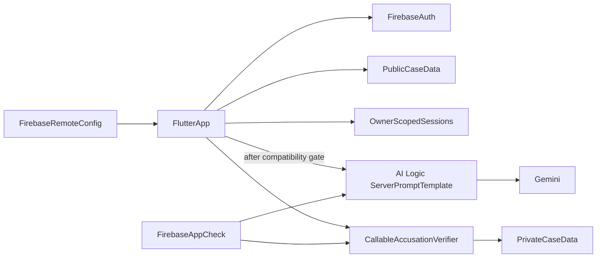

# Murder Mystery Interrogation Game — Secure Incremental Architecture

Status: target architecture for the existing Flutter prototype  
Last reviewed: 2026-07-19

## 1. Purpose and non-negotiable boundaries

This is not a greenfield scaffold. The repository already contains a playable
single-case Flutter prototype using Provider, imperative Navigator routes,
SharedPreferences, Firebase Auth/Firestore, and a direct Gemini REST call.

The migration must preserve the existing gameplay flow while establishing these
boundaries:

1. The Flutter build must never contain the killer, hidden truths, private
   motives, reveal policy, or canonical solution.
2. Firestore documents readable by a player must never contain those values.
3. Final accusation scoring is server-authoritative. A modified client cannot
   declare itself correct.
4. AI requests must not contain a developer API key.
5. Firebase App Check, Authentication, Security Rules, schema validation, and
   usage limits are required before production release.
6. State management and navigation migrations are separate refactors. Provider
   and Navigator remain until a focused migration is justified and protected by
   tests.

## 2. Current-state audit

### Critical findings

- `lib/services/ai_chat_service.dart` contains a committed Gemini API key and
  calls the public Gemini REST endpoint from Flutter. Revoke or rotate that key
  immediately, remove it from the current branch, and inspect repository history
  before enabling another key.
- `lib/data/game_data.dart` declares the killer and private motives in client
  code.
- `lib/models/character.dart` serializes `isKiller` and motive data.
- `lib/models/game_state.dart` persists the full character list to local storage
  and Firestore. Any player can inspect or modify the answer.
- `GameProvider.isCorrectGuess()` scores the accusation locally, so a modified
  app can always produce a successful result.

### Structural findings

- The app uses Provider/ChangeNotifier, not Riverpod.
- Navigation uses `Navigator` and `MaterialPageRoute`, not `go_router`.
- Models are handwritten; Freezed and JSON code generation are not configured.
- Firebase startup is treated as optional, but the initial authentication screen
  requires Firebase. Starting a game then attempts anonymous sign-in even after
  email/password authentication.
- There are no Firestore rules, indexes, emulator configuration, callable
  functions, or CI checks in the repository.
- The only widget test is the stale Flutter counter template and does not
  characterize the current application.
- The Dart constraint in `pubspec.yaml` and the SDK requirement captured by
  `pubspec.lock` need to be aligned before dependency changes.
- `flutter_chat_ui` and `firebase_storage` are declared but currently unused.

### Correction to the previous proposal

The old proposal simultaneously put `Case.solution` and
`Suspect.hiddenTruth` in Dart models while saying they must never reach the
client. Those requirements are incompatible. Public and private schemas must be
different types stored behind different access boundaries.

---

## 3. Target architecture

### 3.1 Runtime flow



Firebase AI Logic is the selected AI product. The normal `firebase_ai` Flutter
SDK calls Gemini from the app without embedding a developer API key. For this
game, direct prompts are still insufficient because system instructions and
case secrets would be inspectable or controllable by the player.

The target therefore depends on Firebase AI Logic server prompt templates:

- Each v1 case/suspect pair has a versioned server prompt template.
- Persona, hidden truth, reveal policy, and response schema are embedded in the
  server template. They are never passed as template inputs by Flutter.
- Flutter passes only bounded conversation history, the latest player message,
  locale, and public identifiers.
- Template IDs and the model name are selected through Remote Config. Template
  IDs are configuration, not secrets.
- Template-only mode prevents arbitrary non-template model calls through the
  project.
- App Check is enforced for Firebase AI Logic before any public release.

### 3.2 Compatibility and release gate

As of this review, server prompt templates are Preview and the official
documentation says Flutter support is coming soon. They also cannot read
Firestore or other project server resources directly.

Do not ship the current direct REST implementation while waiting. AI
interrogation remains a non-production mock until all of these are true:

1. The official Flutter `firebase_ai` package supports server prompt templates.
2. The package is available on the project's supported Flutter/Dart toolchain.
3. Template-only mode works for the selected Firebase project.
4. App Check works on every release platform with production attestation.
5. Multi-turn chat, structured output, timeout, and cancellation behavior pass
   integration tests on real devices.
6. Prompt-leak and prompt-injection tests meet the agreed gameplay threshold.

Server templates hide prompt source, but they do not make an LLM a
cryptographic secret keeper. A model can still reveal information through its
output. If leakage must be strongly prevented, or if templates remain
unsupported, replace this part of the design with a callable backend that can
load private data, inspect responses, and reject or regenerate unsafe output.

### 3.3 Server-authoritative accusation

An authenticated, App Check-protected callable Cloud Function verifies the
final accusation. It:

1. Accepts `sessionId`, `suspectId`, motive choice, and method choice.
2. Derives `uid` from the verified Firebase Auth token.
3. Loads the session and private solution server-side.
4. Validates session ownership, case version, allowed values, and whether an
   accusation was already finalized.
5. Writes the immutable result and returns only the result data intended for
   display.

The client cannot write `solved`, `isCorrect`, the canonical killer, or scoring
fields. Callable functions should use a current supported Node.js runtime with
TypeScript and the latest compatible Firebase Functions SDK.

## 4. Data boundaries

### 4.1 Client-safe Dart models

Only these concepts may be represented in Flutter:

```text
CaseSummary {
  id, version, title, victimDisplayName, setting, briefingText,
  suspectIds, portraitAssetPaths
}

PublicSuspect {
  id, caseId, displayName, role, publicBiography,
  publicAlibi, portraitUrl
}

ChatMessage {
  id, sessionId, suspectId, role, text, createdAt, clientSequence
}

PlayerProgress {
  sessionId, caseId, caseVersion, interviewedSuspectIds,
  displayClueIds, status, createdAt, updatedAt
}

AccusationResult {
  submittedSuspectId, submittedMotiveId, submittedMethodId,
  isCorrect, finalizedAt
}
```

`CaseSummary` must not have a `solution` field. `PublicSuspect` must not have
`hiddenTruth`, `privateMotive`, `isKiller`, `triggerTopics`, or raw system
instructions. Do not add nullable secret fields; use separate server types.

### 4.2 Firestore layout

```text
cases_public/{caseId}
cases_public/{caseId}/suspects/{suspectId}

users/{uid}/sessions/{sessionId}
users/{uid}/sessions/{sessionId}/messages/{messageId}

cases_private/{caseId}
```

- `cases_public` contains published, client-safe metadata. Authenticated clients
  can read it; only trusted server/admin tooling can write it.
- `users/{uid}/sessions` contains owner-scoped progress and transcript data.
  The owner can read it. Client writes are limited to explicitly mutable,
  validated fields.
- `cases_private` contains the canonical solution, case version, accepted
  accusation values, and server publication metadata. Client rules deny every
  read and write.
- The Admin SDK used by the accusation function accesses private data outside
  client Security Rules.

Because prompt templates cannot read `cases_private`, v1 duplicates the minimum
AI-only secret narrative inside each versioned template. A publishing check must
verify that template version, public case version, and private solution version
match. This is acceptable for one static v1 case; it is not a scalable dynamic
case architecture.

### 4.3 Trust classification

AI responses and transcript documents that pass through Flutter are untrusted
presentation data. A modified client can forge them. They must not:

- determine whether an accusation is correct;
- grant paid currency, achievements, or competitive ranking;
- unlock authoritative content without server verification; or
- mutate private case state.

For v1, clue IDs derived from AI output are advisory UI state only. If clues
later affect scoring or entitlements, move clue validation and persistence to a
trusted backend.

## 5. Firebase security controls

### Authentication

- Preserve email/password authentication during the incremental migration.
- Do not silently replace an authenticated user with an anonymous account when
  a game starts.
- If guest play is added, anonymous sign-in is an explicit alternate entry path
  and can later be linked to a permanent account.
- Firebase initialization failure produces a clear blocked/retry state; it is
  not treated as a fully functional offline mode.

### Firestore Security Rules

Before writing rules, identify the target Firestore database and edition. Rules
then follow default deny and least privilege:

- require authentication;
- scope user data to `request.auth.uid`;
- validate exact allowed fields, types, enum values, and realistic size limits;
- apply the same domain validator to create and update;
- protect ownership, case version, and creation timestamps as immutable;
- use server timestamps for authoritative time;
- prevent clients from writing result/scoring fields;
- deny all client access to `cases_private`; and
- test cross-user, schema-pollution, oversized-input, ownership-change, and
  invalid-state-transition attacks in the Emulator Suite.

### App Check and abuse controls

- Enforce App Check for Firebase AI Logic, callable functions, and Firestore
  before production.
- Use only private debug tokens in development. Never commit or ship one.
- Register Play Integrity for Android and the appropriate production provider
  for every other release platform.
- Bound message length, history turns, output tokens, requests per session, and
  concurrent sends.
- Add budget alerts, usage monitoring, retry limits, and a server-side cooldown
  for accusation calls.
- Store no developer Gemini key in Flutter. Firebase-generated client
  configuration values are not a substitute for App Check and Security Rules.

## 6. Incremental migration

Each phase must leave the existing UI flow usable or explicitly gated. Do not
combine these phases with a Riverpod, go_router, or visual redesign migration.

### Phase 0 — Contain the credential

1. Revoke or rotate the committed Gemini key.
2. Check Git history and any distributed builds for exposure.
3. Remove the key and direct REST endpoint from Flutter.
4. Disable production AI calls and use a clearly labeled local mock.
5. Add secret scanning to CI before introducing replacement AI code.

Exit criteria: no active developer AI credential exists in source, Git history,
build artifacts, logs, or client network requests.

### Phase 1 — Stabilize the prototype

1. Align the Dart/Flutter constraints with the lockfile and supported toolchain.
2. Make Firebase initialization and authentication lifecycle explicit.
3. Remove the second anonymous sign-in from game startup.
4. Replace the counter test with characterization tests for authentication,
   starting a game, selecting a suspect, sending a mock message, restoring
   progress, and opening the accusation dialog.
5. Remove only dependencies proven unused after source and platform checks.

Exit criteria: the current flow has passing tests and one consistent identity
for the complete session.

### Phase 2 — Split public and private domain data

1. Introduce client-safe models without secret fields.
2. Convert hardcoded client case content to public-only data.
3. Stop serializing `isKiller`, private motives, or complete characters.
4. Replace local correctness checks with an unavailable/pending server result
   state until Phase 4 is complete.
5. Add serialization tests proving forbidden fields cannot appear.

Exit criteria: inspecting the Flutter source, local preferences, and a player
Firestore export cannot reveal the solution.

### Phase 3 — Establish Firebase data protection

1. Confirm the intended Firebase project and Firestore database edition.
2. Add project aliases, emulator configuration, rules, and required indexes.
3. Implement typed repositories behind the existing Provider API.
4. Migrate public case data and owner-scoped sessions to the new paths.
5. Test rules with two users and hostile payloads.

Exit criteria: cross-user and private-case access are denied, valid app queries
pass, and client writes cannot alter authoritative fields.

### Phase 4 — Add authoritative accusation scoring

1. Add the private case schema and trusted publication process.
2. Implement the authenticated, App Check-protected callable verifier.
3. Make finalization idempotent and transactionally immutable.
4. Update the existing decision flow to consume `AccusationResult`.
5. Test forged IDs, replay, ownership mismatch, malformed input, and concurrent
   finalization.

Exit criteria: modifying Flutter state or Firestore client payloads cannot
produce a false successful result.

### Phase 5 — Integrate Firebase AI Logic after the gate opens

1. Reconfirm current official Flutter support and add the latest compatible
   `firebase_ai`, App Check, and Remote Config packages through Flutter's package
   manager.
2. Provision Firebase AI Logic and enforce template-only mode.
3. Create versioned templates for one case and three suspects.
4. Add bounded multi-turn chat and structured response parsing.
5. Keep the existing Provider-facing service contract so screens do not require
   a state-management rewrite.
6. Run prompt injection, secret extraction, character-break, localization,
   timeout, offline, and cost tests.

Exit criteria: no secret prompt input is assembled in Flutter, App Check is
enforced, unsupported clients fail safely, and red-team leakage stays within the
accepted gameplay threshold.

### Phase 6 — Production hardening

1. Add CI for format, analyze, tests, rules tests, function tests, and secret
   scanning.
2. Add Crashlytics/structured error reporting without message or secret leakage.
3. Configure usage dashboards, budget alerts, and operational rollback.
4. Verify release builds for every target platform.
5. Document case/template version publication and rollback.

## 7. Verification checklist

### Security

- No active API key, private solution, hidden truth, or `isKiller` value appears
  in Flutter source, assets, generated code, local storage, or player-readable
  Firestore documents.
- A second authenticated user cannot read or modify another user's session.
- Clients cannot read `cases_private` or write result fields.
- Forged, repeated, or concurrent accusations cannot bypass the verifier.
- App Check enforcement and production attestation are verified on real devices.
- Prompt injection cannot cause unacceptable solution disclosure according to
  the documented release threshold.

### Functional

- Existing authentication, language choice, game start, suspect selection,
  interrogation, persistence, and accusation UI continue to work after each
  phase.
- AI loading, timeout, retry, cancellation, offline, and malformed-response
  states are visible and recoverable.
- English and Turkish prompts and responses preserve the selected locale.
- A failed Firebase initialization never leaves an interactive screen that will
  crash on first Firebase access.

### Cost and operations

- Message/history/output limits are enforced.
- Retries cannot multiply one player action into uncontrolled requests.
- Budget alerts and usage monitoring are enabled before external testing.
- Template, public case, and private solution versions can be rolled back
  together.

## 8. Package and Cursor skill policy

- Use current official FlutterFire packages and official Firebase guidance.
  Query current package versions at implementation time; do not copy stale
  versions from this document.
- Firebase AI Logic uses `firebase_ai`, not the retired `firebase_vertexai`
  package.
- Keep imports at module scope and preserve exhaustive enum/union handling.
- Third-party Flutter, Riverpod, and UI/UX Cursor skills may improve agent
  guidance, but they are not runtime dependencies and must be reviewed before
  installation.
- Do not combine a Riverpod or go_router migration with security work. If
  selected later, migrate one feature boundary at a time with characterization
  tests.

## 9. Explicitly out of scope for this migration

- Generating the final murder story or additional cases.
- Dynamic or user-generated secret case content.
- A full Riverpod, go_router, Freezed, or Clean Architecture rewrite.
- Replacing the existing visual design system.
- Competitive scoring based on client-observed AI responses.
- Shipping AI interrogation before server prompt template support passes the
  Flutter compatibility gate.
